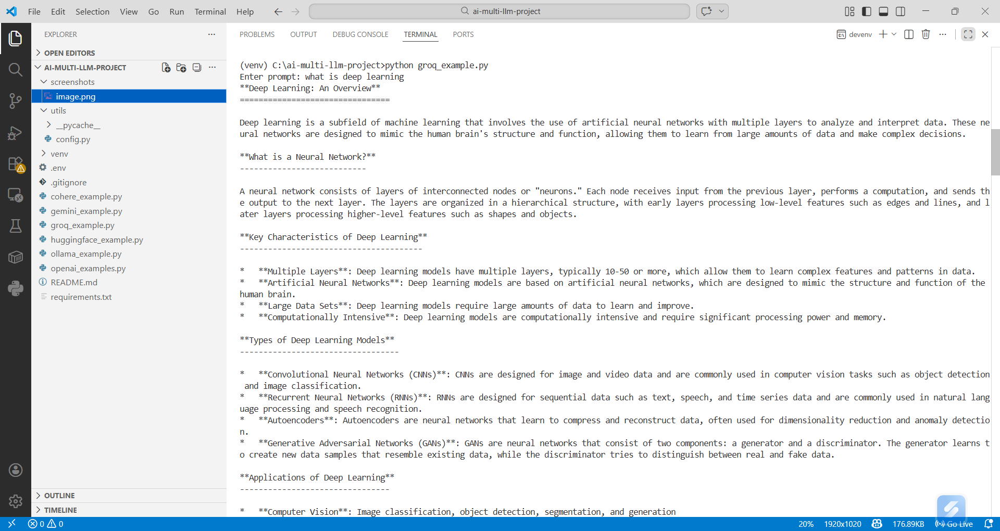
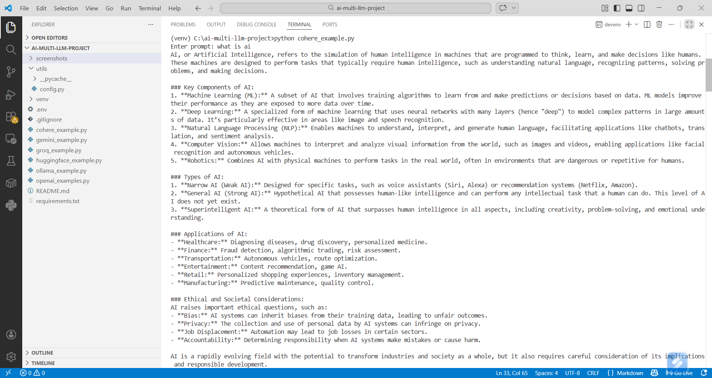
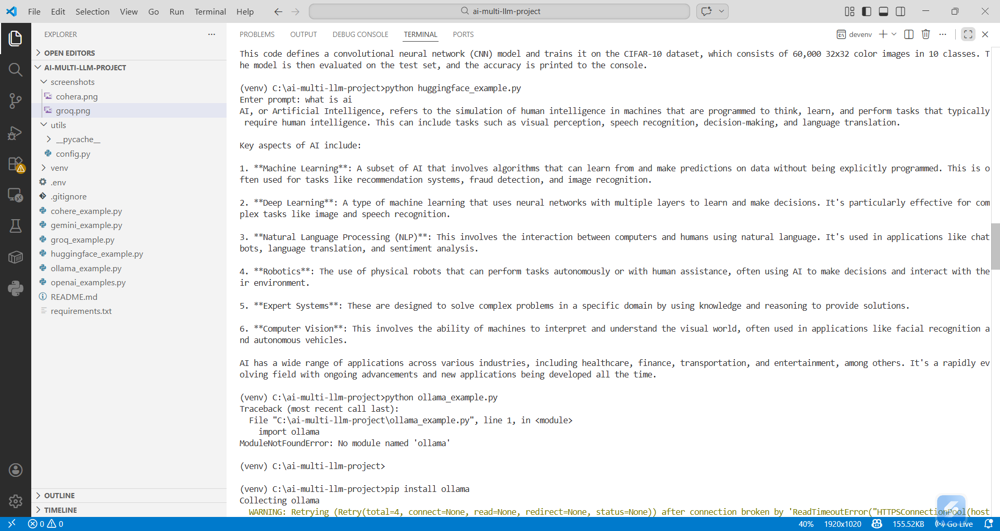
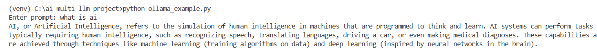
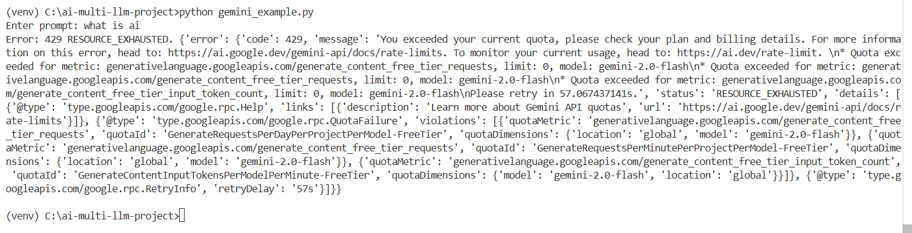
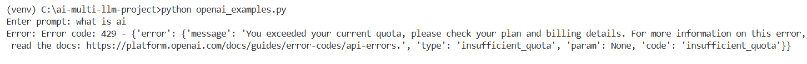

# Multi-LLM API Integration Project

This project demonstrates integration of multiple AI APIs.

## APIs Used
- Groq
- Cohere
- Hugging Face
- Ollama (Local LLM)
- Gemini
- OpenAI

## Features
- Accepts user input
- Generates AI response
- Handles errors gracefully

## How to Run

Install dependencies:
pip install -r requirements.txt

Run any file:
python groq_example.py
python cohere_example.py
python huggingface_example.py
python ollama_example.py

## Screenshots

### Groq Output

### Cohere Output

### HuggingFace Output

### Ollama Output

### Gemini Output (Quota Error)

### OpenAI Output (Quota Error)

## Note
Gemini and OpenAI may show quota errors depending on API limits.